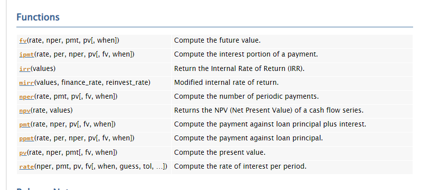

# DPS832-eng-economica

## Análise de Investimentos com Numpy Financial

Mais informações na documentação oficial do Numpy Financial [aqui](https://numpy.org/numpy-financial/dev/).

### Pré-Requisitos

(Desconsiderar se estiver usando o [Google Colab](https://colab.research.google.com/))

Para instalar o pacote numpy-financial, basta executar o comando:

    pip install numpy-financial  (ou pip3)

ou, se você estiver usando o Anaconda, basta executar:

    conda install numpy-financial

(Código testado e rodando com o Python 3.9.7, via Anaconda)

## Fluxo de Caixa

* [Conversões e Equivalências](fluxo.ipynb)

## Métodos Determinísticos de Ánalise de Investimentos

* [VPL - Valor Presente Líquido](vpl.ipynb)
* [VAUE/CAUE - Valor (ou Custo) Anual Uniforme Equivalente](vaue.ipynb)
* [TIR - Taxa Interna de Retorno](tir.ipynb)
  